# Dongmin Park (パク・ドンミン)

## 📖Portfolio

### React-Diary

React.js18

2022.04 - 2022.06

# 

-   **保存、修正、削除、整列 機能具現**
-   レンダリングの最適化に React.memo を使った。
-   props 伝える。
-   色々な JS 文法を勉強になりました。
-   useNavigate, useParams - react-router-dom
-   useContext,useEffect,useState

> 当日の鑑定を選んで日記を書きます。 
> 登録した日記の LIST を表示することができます。 
> 5 つの感情の種類整列機能 
> この該当日記を EDIT、削除ができます。 

選択理由:基本的かつ重要な機能が入っているからです。

Link - [GitHub - mini diary App](https://github.com/dongmin7208/React-diary)

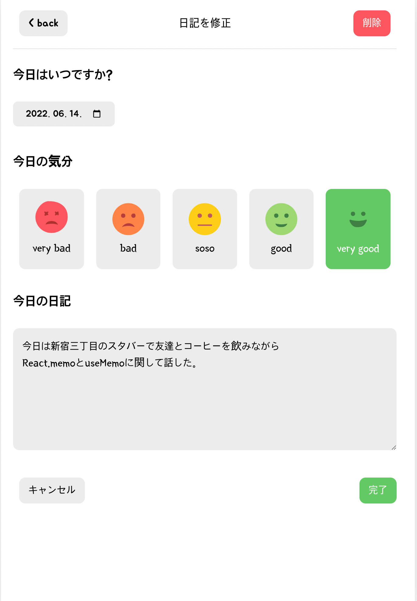

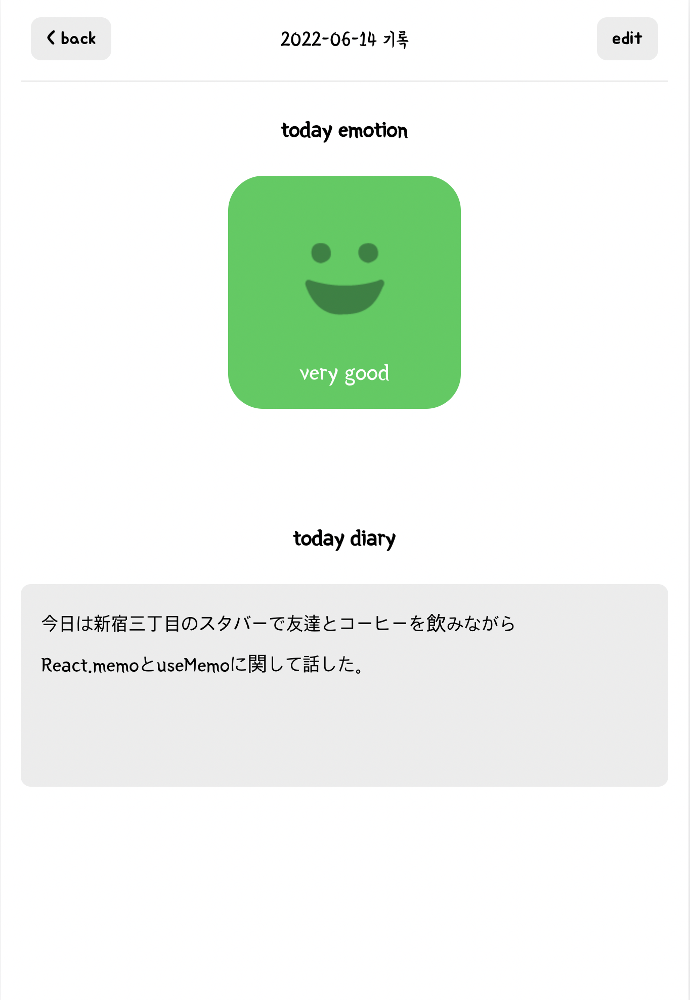
 
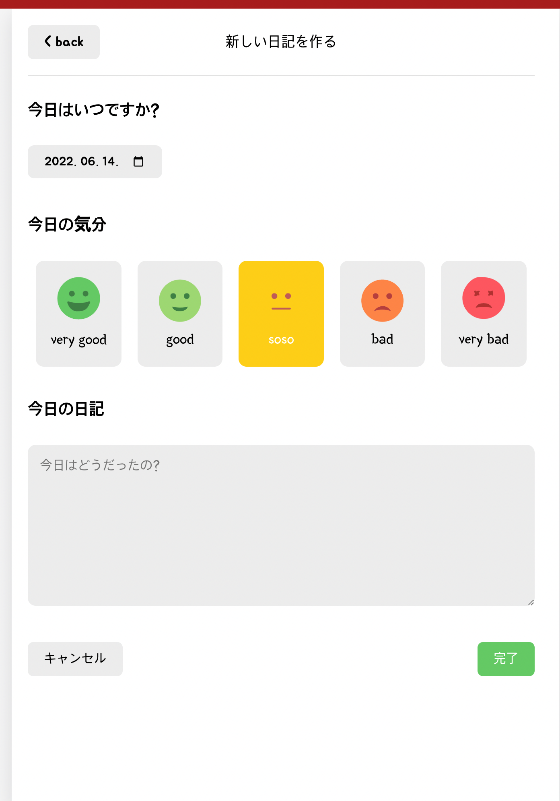

### **Momentum**

Vanilajs

2021.06 - 2021.06

   

-   Local Storage に保存·変更·読み込み使用
-   天気を具現するため Free API サビスーを使った。
-   Javascript 関数について勉強·使用。
-   Javascript は何よりも一番重要だということを学んだ。
-   Javascript の多くの使い方に触れられてよかった。
-   新しい技術を学んで応用することも重要ですが、
-   Javascript はずっと勉強し続けなければならないということを知った。

> Javascript を使ったスマートな APP

-   今日のリストを作ることができる
-   現在の時間機能を実現
-   現在の地域の天気機能を実現
-   名言と背景イメージをランダムに表示する
    >

選択理由: 位置情報を受けて天気 API の使用を学び、TODOLIST のロジックを理解するために選択しました。

Link - [GitHub - dongmin7208/jsBeginners](https://github.com/dongmin7208/jsBeginners)

---

### Zoom

2022.08 - 2022.08

# 

https://user-images.githubusercontent.com/85716180/189566537-852cd07a-908d-4483-b1e0-febcac900740.mov

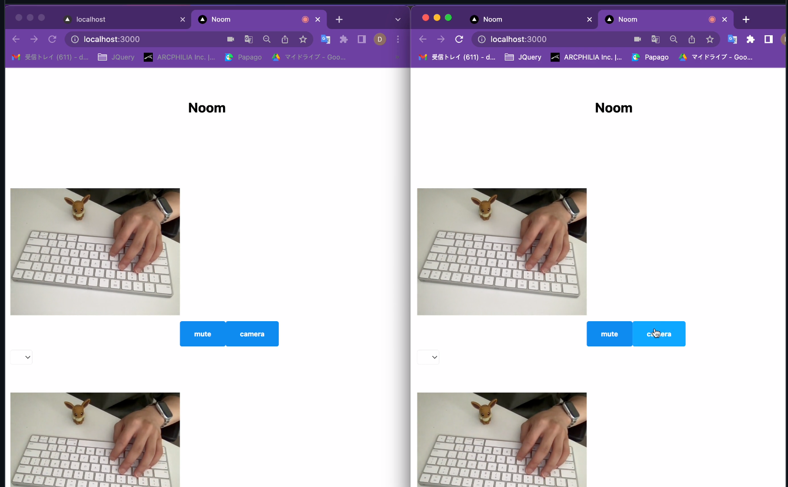

-   SocketIO を使って同時接続具現
-   JS,Node.JS,WebSockets,WebRTC を使った。 
-   VIEW 部分は PUG を使って見ました。 
-   基本的な JS を使いました。 
-   Socket の流れを理解するのが難しかったので、 
-   繰り返しないといけないと言う感じました。 

> SocketIO を使って同じルームで会話ができます。
> 二人が接続して、マイク ON、OFF 、カメラ ON,OFF ができます。
> 同じルームならリアルタイムチャットができる。
> カメラとマイクを許可すれば会話ができる。

選択理由: 実務で実力が足りなくて扱えなかった SocketIO を勉強した。

Link [GitHub - dongmin7208/zoom](https://github.com/dongmin7208/zoom#nodejs-socketio-webrtc-javascript)

---

### **LittleRooms**

HTML/CSS

2021.06 - 2021.06

-   BEM によるフロントエンドの設計の理解
-   いつでもデザイン変化に対応できる
-   プロジェクトメンバーは、お互いのコードに貢献し合える
-   メンバーが同じ言語でやりとりできるので、コミュニケーションが簡単
-   最初は構造設定に多くの時間を使用した。

> HTML と CSS を使用して実在する画面を作ったプロジェクト。
> BEM 方式による構造設計演習を重点とした Project。
> コードレビューを通じて協業過程及び基礎設計構造演習の目的であるプロジェクト。

選択理由:実在する Littlerooms サイトのコンテンツのサイズが決まっていて得意で選択しました。

Link [GitHub - dongmin7208/littlerooms](https://github.com/dongmin7208/littlerooms#screen)

https://user-images.githubusercontent.com/85716180/194101300-a80659fa-b07b-45be-ab12-af2e91e9ee65.mov

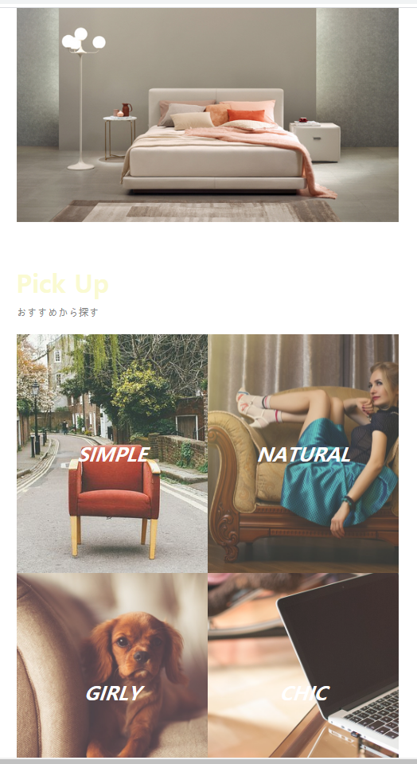

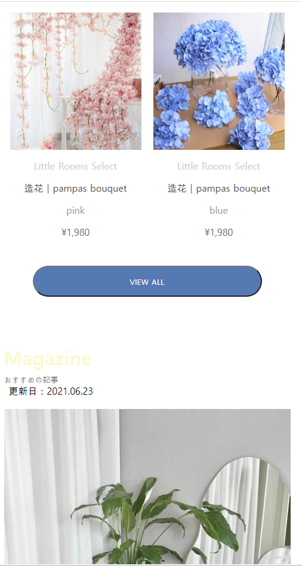

---

### Netflix **+ Markup**

HTML/SCSS/JS/Jquery

2022.08 - 2022.08

-   **多様な CSS に慣れるために作った見た目サイト**
-   **R**esponsive web design
-   Accordian,toggle,Animation,Dark-Mode など
-   上の機能を JQuery も使って JS も使って具現してみました。

> どんな状態の画面も作れるように HTML と SCSS を練習しました。
> NETFLIX のサイトを真似してよくある質問にある BUTTON を押したら出る機能を作りました。
> Login の Form を作ってみました。
> Table,Grid を使って簡単な画面を作りました。

選択理由:多様な CSS を学ぶため選びました。

Link [GitHub - dongmin7208/WebPublilshing](https://github.com/dongmin7208/WebPublilshing#web-publilshing-)

https://user-images.githubusercontent.com/85716180/194101357-2cfd512b-bcf4-4a70-9ddd-bdfc17f2e79b.mov

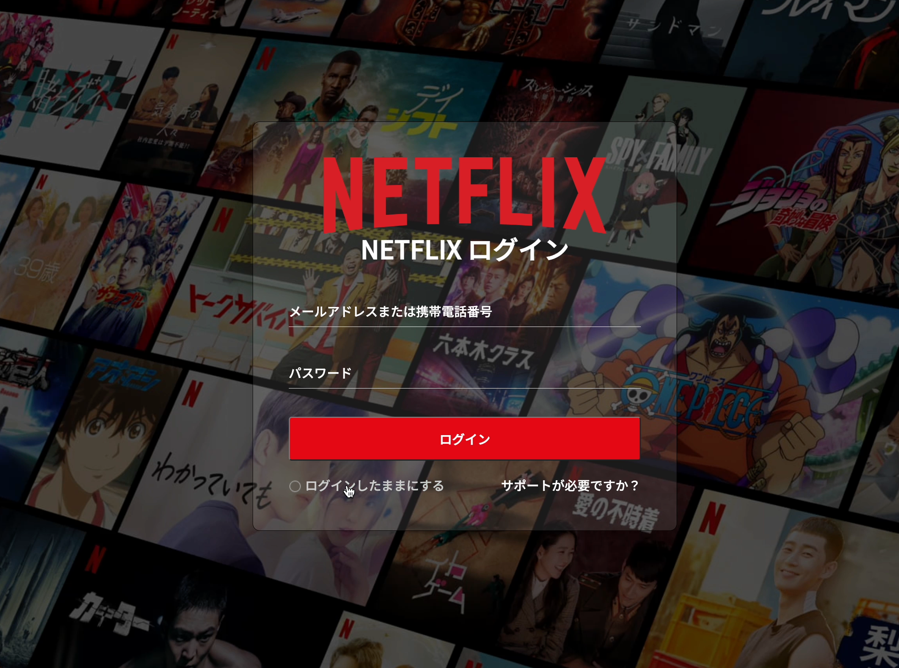

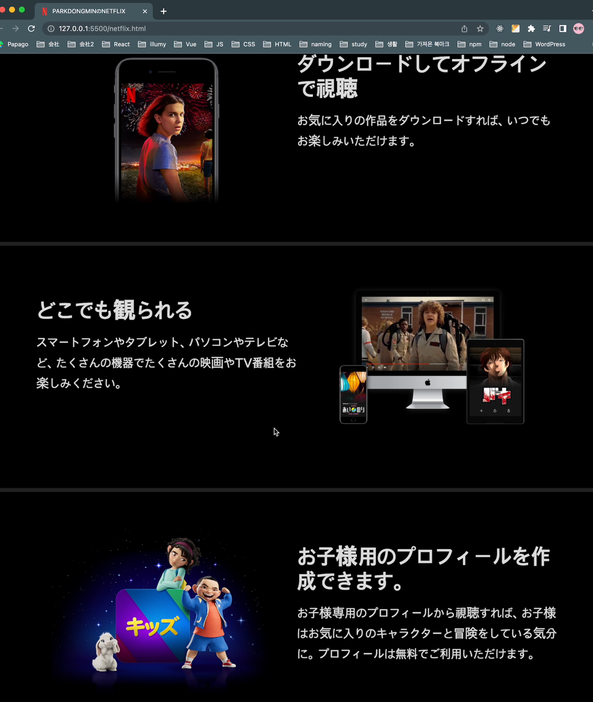
 
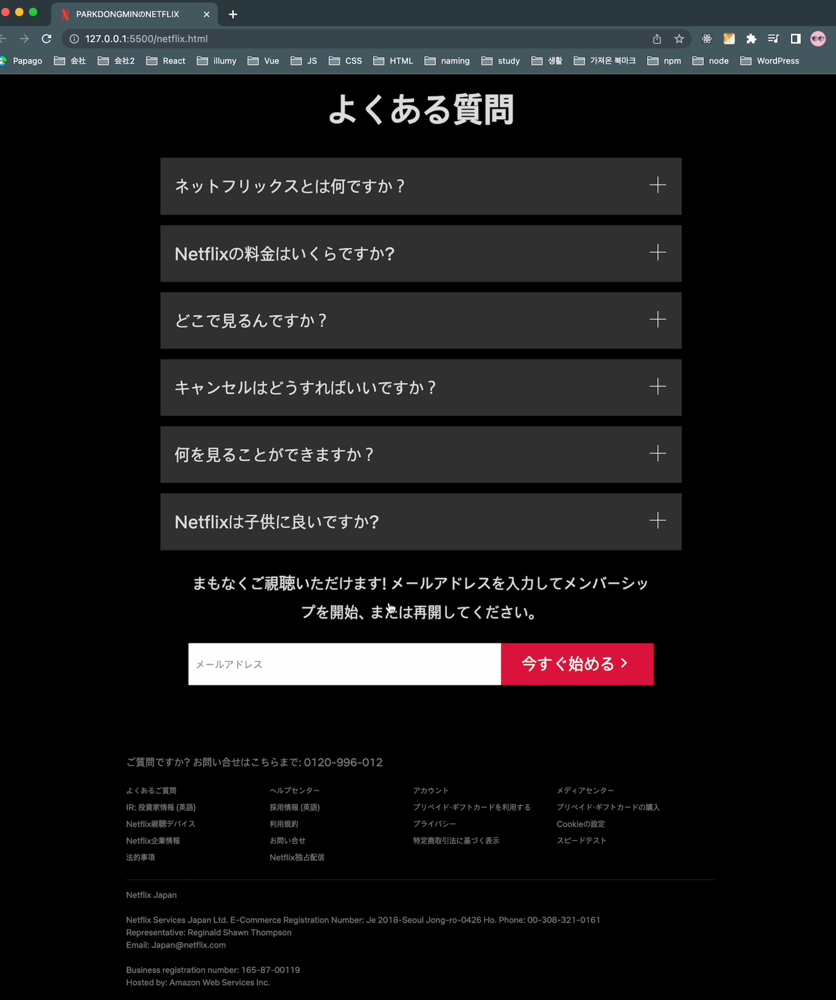

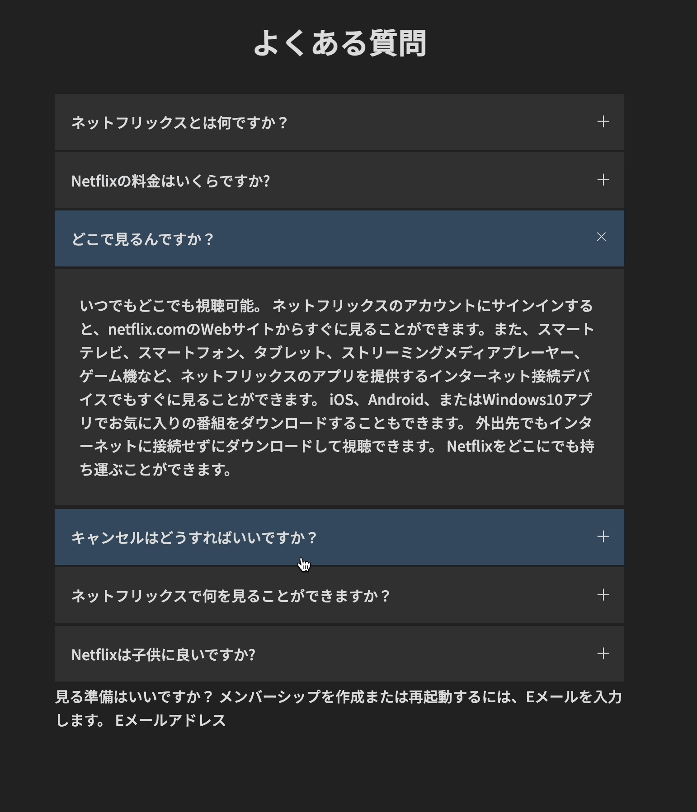

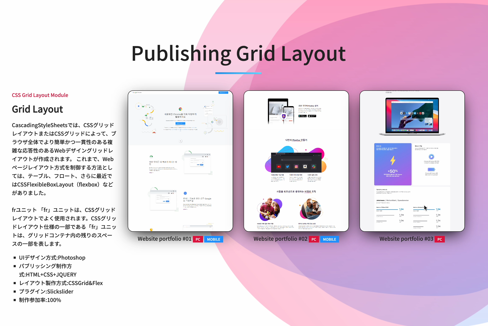

---

### Youtube

React(Next.js)

2022.06 〜

-   義本的な CRUD 機能具現して見ました。
-   ES6 + Pug + Babel + Passport + Node + AJAX + Webpack + SCSS + Mongoose + Multer + ESLint
-   MongoDB + NodeJS + Express

> まだ開発中。。
> VIDEO 登録してみることができる。

選択理由:ZOOM を通じて勉強をしてみたんですけど足りなかったと思って選びました。

Link [GitHub - dongmin7208/wetube](https://github.com/dongmin7208/wetube)

### Twitter(Next.js)

2022.06 〜

-   Next.js(SSR) + React Hooks + Redux + Redux saga + Ant Design + Styled Components + Node + Express + Sequelize(MySQL)
-   AWS
-   EC2 + Lambda + S3 + Route53

> 開発中。。

選択理由:React アプリのサーバーサイドレンダリング（SSR）を触ったことなかったので選びました。

Github: [https://github.com/dongmin7208/react-nodebird](https://github.com/dongmin7208/react-nodebird)

### Slack

React(Next.js)

2022.06 〜

-   React + SWR + Socket.io + TypeScript + Emotion + Webpack + Babel +
-

> 開発中。。

選択理由:SWR と typeScript を触ったことなかったので選びました。

Link [GitHub - dongmin7208/slack](https://github.com/dongmin7208/slack)

Github: [https://github.com/dongmin7208/react-nodebird](https://github.com/dongmin7208/react-nodebird)
